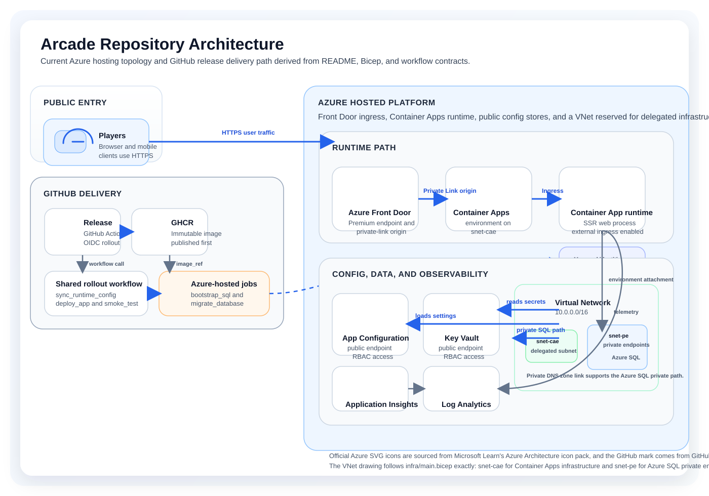

# Arcade

Arcade is a React Router server-rendered web app for two competitive puzzle games: Minesweeper and Sudoku. It keeps a shared home dashboard, per-game play history, result summaries, rankings, and a profile surface in one organization-account experience across the home tenant and other Microsoft Entra organizations.

## Current State

- Local development is working against SQL Server compatible paths with SSR, cookie session auth, real Minesweeper and Sudoku gameplay, rankings, result flows, and profile editing.
- The repository target for hosted environments is Azure Container Apps with GitHub Release driven CD, `Microsoft Entra ID` sign-in, Azure SQL over `Private Endpoint`, App Configuration and Key Vault backed runtime config, Application Insights, and Log Analytics.
- Operational notes for rollback, smoke checks, private-network verification, and observability live in `docs/production-operations.md`.

## Architecture



This diagram reflects the current hosted contract in this repository.

- GitHub Releases publish an immutable image to GHCR, then GitHub Actions uses OIDC to drive the Azure rollout path.
- Azure Front Door Premium is the public entrypoint, with Azure Container Apps hosting the SSR web runtime.
- Runtime configuration flows through App Configuration and Key Vault over RBAC-protected public endpoints, while the VNet is reserved for the Container Apps delegated subnet and the Azure SQL private-endpoint path.
- Schema bootstrap and migration stay in Azure-hosted jobs instead of GitHub-hosted runners.

The diagram uses local copies of official Azure Architecture icons from Microsoft Learn and the official GitHub mark from GitHub Brand Toolkit so the README can render without external asset dependencies.

## Local Development

### Prerequisites

- Node.js 20+
- npm 10+

### Install

```bash
npm install
```

### Run

```bash
npm run dev
```

If `DATABASE_URL` is not configured or the local SQL path is unavailable, the development server falls back to in-memory fixture data for browser-based UI review on `/login`, `/home`, `/games/:gameKey`, `/results/:resultId`, `/rankings`, and `/profile`.

### Useful Commands

```bash
npm run typecheck
npm run build
npm run db:generate
npm run db:migrate
npm run db:migrate:deploy
npm run db:migrate:status
npm run db:seed
```

## Verified Local Flows

- Sign in with seeded users on `/login`
- Navigate across `/home`, `/games/:gameKey`, `/results/:resultId`, `/rankings`, and `/profile`
- Create completed, pending-save, and abandoned gameplay results
- Retry pending-save results from the result screen
- Edit profile display name, tagline, visibility scope, and favorite game
- Switch ranking scope between overall and game-specific views

## Runtime Configuration

The hosted runtime now boots from Azure App Configuration plus Key Vault references through `@azure/app-configuration-provider`.

Hosted bootstrap environment values:

- `NODE_ENV`
- `AZURE_APPCONFIG_ENDPOINT`
- `AZURE_APPCONFIG_LABEL` when labeled App Configuration values are used
- `AZURE_KEY_VAULT_URI`

Azure App Configuration keys use the `Arcade:` prefix and hold non-secret settings such as:

- `Arcade:ARCADE_AUTH_MODE`
- `Arcade:PUBLIC_APP_URL`
- `Arcade:ENTRA_TENANT_ID`
- `Arcade:ENTRA_AUTHORITY_TENANT`
- `Arcade:ENTRA_CLIENT_ID`

Azure Key Vault remains the source of truth for secrets:

- `arcade-session-secret`
- `database-url`
- `entra-client-secret`

Azure App Configuration should reference those Key Vault secrets for:

- `Arcade:ARCADE_SESSION_SECRET`
- `Arcade:DATABASE_URL`
- `Arcade:ENTRA_CLIENT_SECRET`

For local development, the app still supports shell-based fallback when `AZURE_APPCONFIG_ENDPOINT` is intentionally unset or when the signed-in Azure path is unavailable. Do not add `.env` files to this repository.

Hosted runtime config sync is workflow-owned. Use GitHub `Release Azure Delivery` or `Bootstrap Azure Recovery` instead of local Azure sync entrypoints.

## Azure Workflows

This repo uses GitHub Actions OIDC for hosted Azure delivery.

- `.github/workflows/bootstrap-azure-recovery.yml`
  Bootstrap from an empty resource group and worst-case recovery
- `.github/workflows/release-container-image.yml`
  Routine release delivery
- `.github/workflows/verify-production-runtime.yml`
  Scheduled and on-demand hosted runtime verification

## Before Running GitHub Workflows

For this repo, the human-side setup is mostly these 3 buckets.

1. Create GitHub Actions OIDC identities in Azure.
   Create 2 identities: `production` and `production-bootstrap`.
   Each one needs a `federated credential`. Creating only a `Service Principal` is not enough; the required Azure RBAC must also be granted.
   `production` needs `Contributor`, `App Configuration Data Owner`, and `Key Vault Secrets Officer` on the target resource group.
   `production-bootstrap` needs permission to create the resource group and run bootstrap deploys, plus `Role Based Access Control Administrator` or `User Access Administrator`.

2. Set GitHub Environment variables and secrets.
   `production`:

   | Type | Name | Purpose | How to get it |
   | --- | --- | --- | --- |
   | Variable | `AZURE_CLIENT_ID` | OIDC deploy identity used by routine release jobs | Use the `clientId` of the App registration / Service Principal created for the `production` Environment |
   | Variable | `AZURE_TENANT_ID` | Azure login target tenant | Use the target Azure tenant `tenantId` |
   | Variable | `AZURE_SUBSCRIPTION_ID` | Azure login target subscription | Use the target Azure subscription `subscriptionId` |
   | Variable | `AZURE_RESOURCE_GROUP` | Routine deploy target resource group | Decide the target resource group name for routine deploys |
   | Variable | `AZURE_APP_NAME` | Canonical app name. The Container App name is derived as `ca-${AZURE_APP_NAME}` | Set the repo-level app name. The current default is `arcade` |
   | Variable | `ENTRA_CLIENT_ID` | `clientId` of the end-user sign-in `web` app registration | Use the `clientId` of the Entra app registration used by the app itself |
   | Secret | `ARCADE_SESSION_SECRET` | Session cookie secret | Generate a strong random secret |
   | Secret | `ENTRA_CLIENT_SECRET` | Client secret for the end-user sign-in `web` app registration | Create a client secret on the Entra app registration used by the app itself |

   `production-bootstrap`:

   | Type | Name | Purpose | How to get it |
   | --- | --- | --- | --- |
   | Variable | `AZURE_CLIENT_ID` | OIDC bootstrap identity used by recovery jobs | Use the `clientId` of the App registration / Service Principal created for the `production-bootstrap` Environment |
   | Variable | `AZURE_TENANT_ID` | Azure login target tenant | Use the target Azure tenant `tenantId` |
   | Variable | `AZURE_SUBSCRIPTION_ID` | Azure login target subscription | Use the target Azure subscription `subscriptionId` |
   | Variable | `AZURE_LOCATION` | Resource group and infra deploy region | Decide the target Azure region |
   | Variable | `AZURE_RESOURCE_GROUP` | Bootstrap target resource group | Decide the target resource group name for bootstrap and recovery |
   | Variable | `AZURE_APP_NAME` | Canonical app name. The Container App name is derived as `ca-${AZURE_APP_NAME}` | Set the repo-level app name. The current default is `arcade` |
   | Variable | `SQL_ADMINISTRATOR_LOGIN` | Azure SQL server create-time administrator login | Decide the bootstrap SQL admin login name |
   | Secret | `SQL_ADMINISTRATOR_PASSWORD` | Azure SQL server create-time administrator password | Generate a strong password for bootstrap-time SQL server creation |

3. Create the app sign-in Entra app registration.
   This is separate from the GitHub Actions OIDC identity.
   The app itself needs a multi-tenant `web` app registration for end-user sign-in.
   Keep the app registration `signInAudience` at `AzureADMultipleOrgs`, keep runtime authority on `organizations`, store `ENTRA_CLIENT_ID` and `ENTRA_CLIENT_SECRET` in GitHub Environments, and set the redirect URI to `https://<public-host>/auth/callback`.

For a dev-phase resource-group switch, usually changing `AZURE_RESOURCE_GROUP`, `AZURE_APP_NAME`, and `AZURE_LOCATION` is enough before rerunning the workflows.

## More Detail

- [docs/azure-prerequisites.md](/Users/hiroki/arcade-spec/docs/azure-prerequisites.md)
- [docs/production-operations.md](/Users/hiroki/arcade-spec/docs/production-operations.md)
- [docs/repository-rename-runbook.md](/Users/hiroki/arcade-spec/docs/repository-rename-runbook.md)
